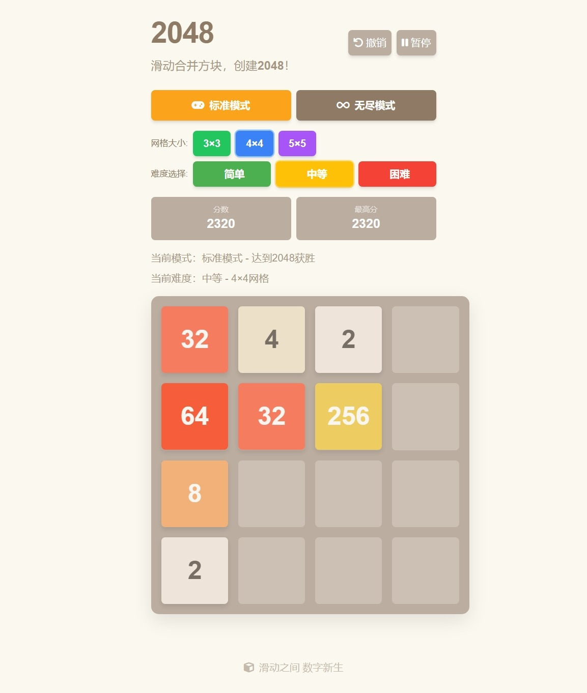

# 2048 游戏

一个基于 HTML5 和 JavaScript 的 2048 游戏实现，支持多种游戏模式、难度选择和网格大小。

## 功能特性

- 🎮 **多种游戏模式**
  - 标准模式（达到 2048 获胜）
  - 无尽模式（挑战最高分）
  
- ⚙️ **自定义设置**
  - 3×3、4×4、5×5 三种网格大小
  - 简单、中等、困难三种难度
  - 支持 GPU 加速
  - 浅色/深色主题切换

- 🔄 **游戏功能**
  - 撤销操作（最多 10 步）
  - 暂停/继续游戏
  - 自动保存游戏进度
  - 导入/导出游戏数据

- 📱 **响应式设计**
  - 适配各种屏幕尺寸
  - 支持触摸屏操作
  - 键盘方向键控制

## 游戏预览

  
点击展开游戏截图

  
  
  *（图为v1.15.3）*

## 游戏控制

- **键盘**：使用方向键移动方块
- **触摸屏**：滑动屏幕移动方块
- **快捷键**：
  - `P` 或 `ESC`：暂停/继续游戏
  - `Ctrl+Z`：撤销上一步

## 开发技术

- HTML5
- CSS3 (Tailwind CSS)
- JavaScript
- 响应式设计
- 本地存储（保存游戏状态）

## 后续计划

- [ ] 重构代码，提升运行效率（v2.0）
